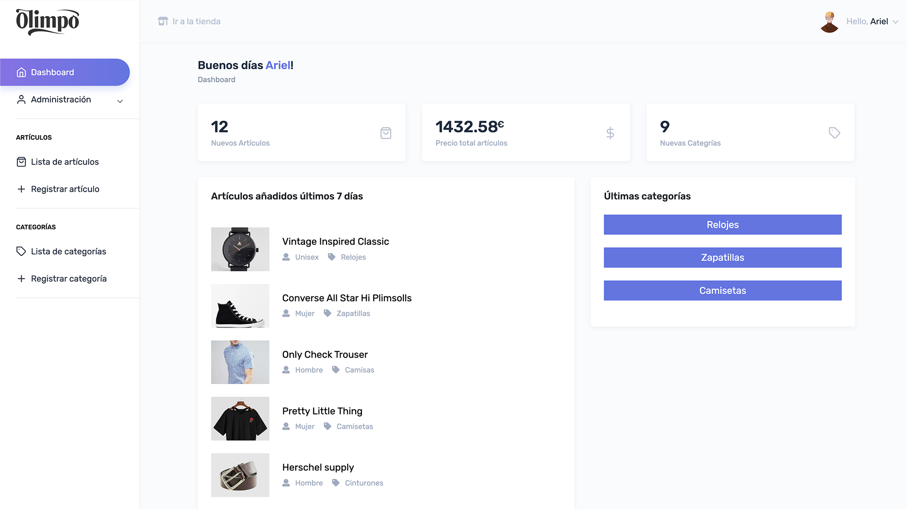

<!-- Improved compatibility of back to top link: See: https://github.com/othneildrew/Best-README-Template/pull/73 -->

<a name="readme-top"></a>

<!--
*** Thanks for checking out the Best-README-Template. If you have a suggestion
*** that would make this better, please fork the repo and create a pull request
*** or simply open an issue with the tag "enhancement".
*** Don't forget to give the project a star!
*** Thanks again! Now go create something AMAZING! :D
-->

<!-- PROJECT LOGO -->
<br />
<div align="center">
  <a href="https://github.com/agueriv/">
    
  </a>

  <h3 align="center">OlimpoFashion</h3>

  <p align="center">
    Tienda online de productos de moda realizada con Laravel usando Ajax
    <br />
    <a href="https://github.com/agueriv/README.md"><strong>Explora la documentación »</strong></a>
    <br />
    <br />
    <a href="https://agueriv3110.ieszaidinvergeles.es/.daw/OlimpoFashion/public/">Ver demo</a>
  </p>
</div>

<!-- TABLE OF CONTENTS -->
<details>
  <summary>Tabla de Contenidos</summary>
  <ol>
    <li>
      <a href="#sobre-el-proyecto">Sobre el Proyecto</a>
      <ul>
        <li><a href="#stack-de-tecnologías">Stack de Tecnologías</a></li>
      </ul>
    </li>
    <li>
      <a href="#getting-started">Getting Started</a>
      <ul>
        <li><a href="#prerequisites">Prerequisites</a></li>
        <li><a href="#installation">Installation</a></li>
      </ul>
    </li>
    <li><a href="#usage">Usage</a></li>
    <li><a href="#roadmap">Roadmap</a></li>
    <li><a href="#contributing">Contributing</a></li>
    <li><a href="#license">License</a></li>
    <li><a href="#contact">Contact</a></li>
    <li><a href="#acknowledgments">Acknowledgments</a></li>
  </ol>
</details>

<!-- ABOUT THE PROJECT -->

## Sobre el Proyecto

Este proyecto consta de dos partes:
-   <b>Back-end (Almacen)</b>: Esta es la parte de administración de la aplicación. En ella podrás dar de altas nuevos artículos y categorías además de gestionar los usuarios si tienes rol de Superadministrador.



-   <b>Front-end (Tienda)</b>: Esta es la parte donde encontrarás todo el catálogo de OlimpoFashion y podrás añadir artículos al carrito, eliminarlos, filtrar por secciones, categorías y ordenar por precio y nombre.


<p align="right">(<a href="#readme-top">Inicio</a>)</p>

### Stack de Tecnologías

This section should list any major frameworks/libraries used to bootstrap your project. Leave any add-ons/plugins for the acknowledgements section. Here are a few examples.

-   [![Next][Next.js]][Next-url]
-   [![React][React.js]][React-url]
-   [![Vue][Vue.js]][Vue-url]
-   [![Angular][Angular.io]][Angular-url]
-   [![Svelte][Svelte.dev]][Svelte-url]
-   [![Laravel][Laravel.com]][Laravel-url]
-   [![Bootstrap][Bootstrap.com]][Bootstrap-url]
-   [![JQuery][JQuery.com]][JQuery-url]

<p align="right">(<a href="#readme-top">Inicio</a>)</p>

<!-- GETTING STARTED -->

## Cómo empezar

Para comenzar a usar la aplicación te dejo aquí unos pequeños pasos para una correcta instalación y puesta en funcionamiento.

### Instalación

1. Clonar el repositorio
    ```sh
    git clone https://github.com/agueriv/OlimpoFashion.git
    ```
3. Crear carpeta data en `compose/mysql` (aquí almacenará la aplicación los datos de la base de datos)
    ```sh
    mkdir compose/mysql/data
    ```
3. Instalar aplicación mediante composer
    ```sh
    composer install
    ```
4. Arrancar aplicación mediante docker-compose
    ```sh
    docker-compose up -d
    ```
5. Como alternativa al punto 2, si no dispones de composer en tu máquina local puedes iniciar la aplicación y después realizar la instalación a través de docker
    ```sh
    docker-compose exec olimpo composer install
    ```
6. Una vez arrancada la aplicación, deberás realizar las migraciones de la base de datos para crear las tablas de la aplicación
    ```sh
    docker-compose exec olimpo php artisan migrate
    ```

<p align="right">(<a href="#readme-top">Inicio</a>)</p>

<!-- USAGE EXAMPLES -->

## Uso

Para usar esta aplicación basta con desplegarla siguiendo los pasos y estará lista para crear tus productos.

<p align="right">(<a href="#readme-top">Inicio</a>)</p>

<!-- CONTRIBUTING -->

## Contribuciones

Contributions are what make the open source community such an amazing place to learn, inspire, and create. Any contributions you make are **greatly appreciated**.

If you have a suggestion that would make this better, please fork the repo and create a pull request. You can also simply open an issue with the tag "enhancement".
Don't forget to give the project a star! Thanks again!

1. Fork the Project
2. Create your Feature Branch (`git checkout -b feature/AmazingFeature`)
3. Commit your Changes (`git commit -m 'Add some AmazingFeature'`)
4. Push to the Branch (`git push origin feature/AmazingFeature`)
5. Open a Pull Request

<p align="right">(<a href="#readme-top">back to top</a>)</p>

<!-- LICENSE -->

## Licencia

Distribuida bajo licencia MIT. Lee `LICENSE` para más información.

<p align="right">(<a href="#readme-top">Inicio</a>)</p>

<!-- CONTACT -->

## Contacto

Ariel Guerrero - rivasguerreroariel@gmail.com

Enlace del proyecto: [https://github.com/agueriv/OlimpoFashion](https://github.com/agueriv/OlimpoFashion)

<p align="right">(<a href="#readme-top">Inicio</a>)</p>